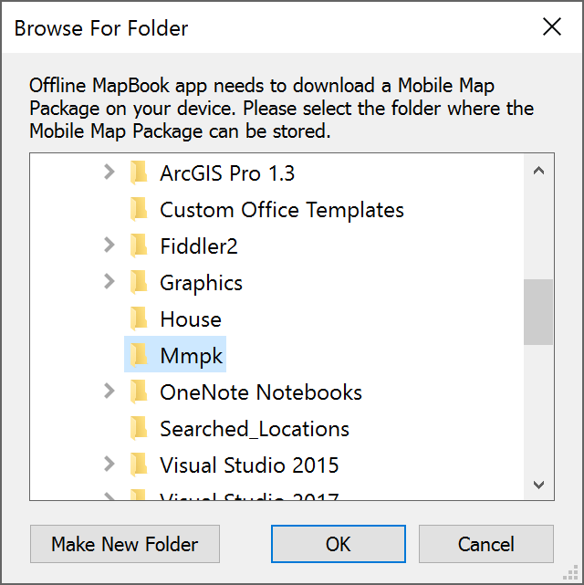
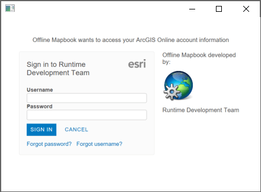
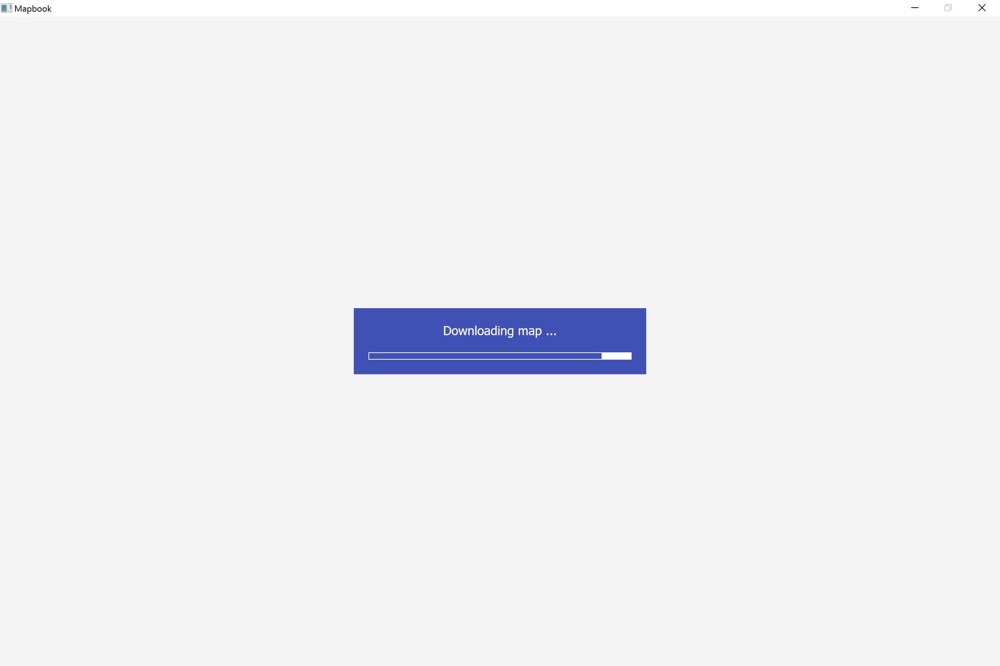
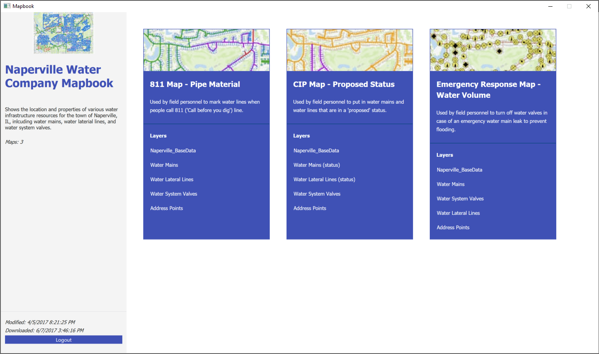
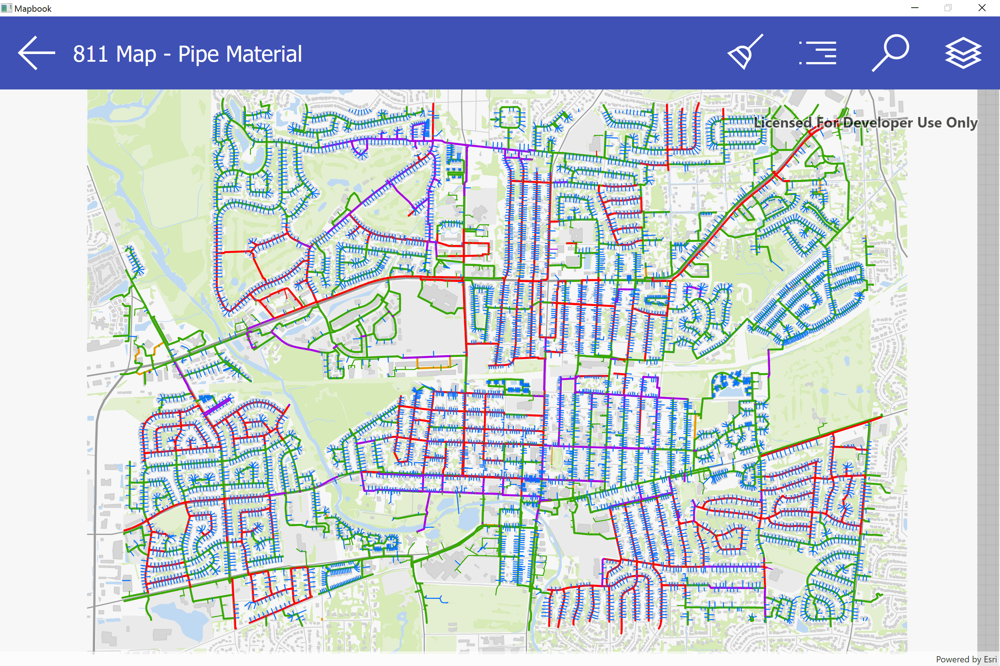
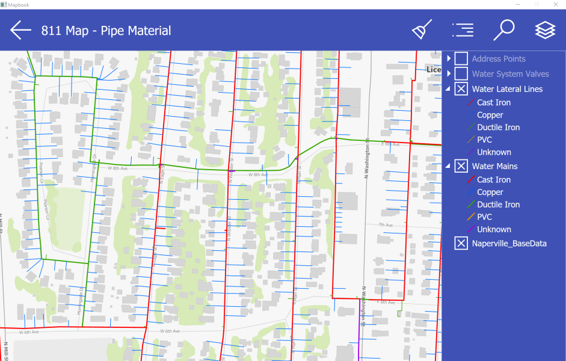
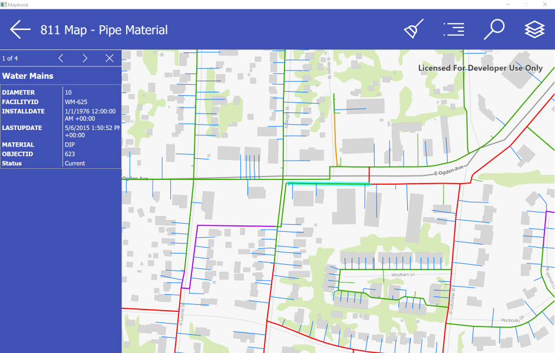
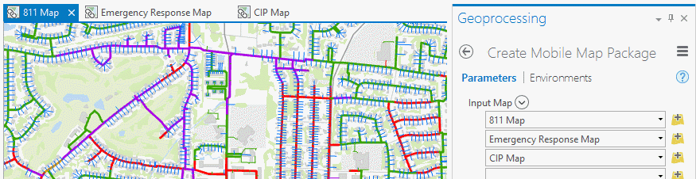

# Documentation

<!-- MDTOC maxdepth:6 firsth1:0 numbering:0 flatten:0 bullets:1 updateOnSave:1 -->

- [Application workflow](#application-workflow)   
- [Data preparation](#data-preparation)   
   - [Data scenario](#data-scenario)   
   - [Authoring the data for viewing](#authoring-the-data-for-viewing)   
      - [Setting symbology](#setting-symbology)   
      - [Creating a reference backdrop](#creating-a-reference-backdrop)   
      - [Creating locators](#creating-locators)   
      - [Setting bookmarks](#setting-bookmarks)   
      - [Metadata and thumbnails](#metadata-and-thumbnails)   
      - [Packaging for consumption](#packaging-for-consumption)   
      - [Including multiple maps](#including-multiple-maps)   
      - [Including the locator](#including-the-locator)   
   - [Sharing the mobile map package](#sharing-the-mobile-map-package)   
      - [Using the ArcGIS Pro 'Share Package' tool](#using-the-arcgis-pro-share-package-tool)   
      - [Uploading directly from the 'My Content' page](#uploading-directly-from-the-my-content-page)   
- [App developer patterns](#app-developer-patterns)   
   - [Authentication](#authentication)   
      - [IWA](#iwa)   
      - [OAuth 2.0](#oauth-20)   
   - [Mobile map packages](#mobile-map-packages)   
   - [Identify](#identify)   
   - [Identify side panel](#identify-side-panel)   
   - [TOC and legend](#toc-and-legend)   
   - [Locator & search](#locator-search)   
   - [Clearing graphics](#clearing-graphics)   
   - [Bookmarks](#bookmarks)   
- [App architecture](#app-architecture)   
- [App customization](#app-customization)   
   - [Customizable](#customizable)   
      - [`MmpkFileName`](#mmpkfilename)   
      - [`PortalUri`](#portaluri)   
      - [`PortalItemID`](#portalitemid)   
      - [`AuthenticationType`](#authenticationtype)   
      - [`OAuthClientID`, `OAuthClientSecret` and `OAuthRedirectUri`](#oauthclientid-oauthclientsecret-and-oauthredirecturi)   
   - [Not customizable](#not-customizable)   
      - [`DownloadPath`](#downloadpath)   
      - [`MapPinHeight`](#mappinheight)   
      - [`OAuthRefreshToken`](#oauthrefreshtoken)   

<!-- /MDTOC -->
---

Learn how to create and share mobile map packages so that you can take your organization's maps offline and view them in the field with a WPF application.  This example demonstrates how to:

- Create and share a mobile map package
- Download the mobile map package from an organization using authenticated access
- Display a table of contents (TOC) and legend
- Identify multiple features and display popup data within a side panel
- Use locators to Search
- Show bookmarks

## Application workflow

The app starts by prompting the new user for a location to store the mobile map package. This location can be a secure location on the user's local profile or a public location on a shared drive. The only requirement is that the user has write access to the location



Once a valid location is selected, the user is prompted with a sign-in screen to authenticate into ArcGIS Online in order to download the mobile map package. The app provides workflows for no security, OAuth2 security and IWA. See the [Authentication](#authentication) section below for details.



After successful authentication, the mobile map package downloads from ArcGIS Online into the folder specified by the user.



When the download completes, the app opens on the main page, displaying the contents of the mobile map package. The example mmpk contains 3 maps belonging to the fictional Naperville Water Company.
On the left of the screen, there are details about the mmpk, such as title, description, number of maps, modification date and download date. These date are used by the app to insure the user always has the latest version of the mmpk. The Logout button causes the user to be signed out of ArcGIS Online and the mmpk to be deleted.



On the right, information about each of the 3 maps is displayed. Clicking on the map thumbnail opens the map.



The map has a toolbar at the top with buttons:

- Back - takes user back to the main screen
- Clear - clears all selections and searches
- Bookmarks - displays a list of bookmarks that the user can select from
- Search - opens a search box and allows user to search map based on locator configuration (address points, valves, pipes and mains)
- Table of Contents - shows layers in the map and allows users to turn layer visibility on/off

|Search|Table of Contents|
|----|----|
|||

The user can also Identify a feature by tapping on the map. This brings up a list of the attributes of that feature and the user can scroll between features if the location tapped happened to contain multiple features.



The workflow described above pertains to the mobile map package provided as an example with this application. However, the app is fully configurable and customizable so the developer can use a different mobile map package with minimal modifications needed. See the remainder of this doc on how to make this app your own.

## Data preparation

Here we describe the steps for authoring and packaging the mobile map package used by the WPF app. This work was performed using ArcGIS Pro 1.4.1.

### Data scenario

In this example, an employee of the fictitious 'Naperville Water Company' requires offline access to the following types of data while out in the field:

- An 811 map displaying locations of water mains and lines that should be marked when citizens call '811'
- An emergency response map displaying locations of water valves and their associated mains that might need to be turned off in the case of an emergency leak
- A capital improvement project (CIP) map displaying locations of newly-proposed water mains and water lines that need to either be further assessed or established

The table below summarizes the layers within each map that are visible by default:

| Layer                   | 811 Map | Emergency Response Map | CIP Map |
|:------------------------|:-------:|:----------------------:|:-------:|
| **Water Lateral Lines** | X       |                        | X       |
| **Water Mains**         | X       | X                      | X       |
| **Water System Valves** |         | X                      |         |
| **Reference Backdrop**  | X       | X                      | X       |

### Authoring the data for viewing

#### Setting symbology

It was important that each map be made to look unique and effectively convey its purpose. In order to achieve this, field attributes were chosen that were most relevant to the map's intended goal and then symbolized using a unique value renderer. In many cases, this yielded multiple classes being represented per layer. The following table identifies the attribute chosen for each layer on a per-map basis.

| Layer                   | 811 Map       | Emergency Response Map | CIP Map         |
|:------------------------|:-------------:|:----------------------:|:---------------:|
| **Water Lateral Lines** | pipe material |                        | proposal status |
| **Water Mains**         | pipe material | pipe diameter          | proposal status |
| **Water System Valves** |               | valve type             |                 |

#### Creating a reference backdrop

To keep the mobile map package (.mmpk) as small as possible, the reference layer was packaged into a .vtpk or [vector tile package](https://pro.arcgis.com/en/pro-app/help/sharing/overview/vector-tile-package.htm) and used as basemap within each map. For more information about how to create a vector tile package, see the help topic for the [Create Vector Tile Package](https://pro.arcgis.com/en/pro-app/tool-reference/data-management/create-vector-tile-package.htm) geoprocessing tool.

#### Creating locators

The Offline Mapbook app supports geocoding and search so a [locator](https://desktop.arcgis.com/en/arcmap/10.3/guide-books/geocoding/essential-geocoding-vocabulary.htm) was built for each layer in the app by using the [Create Address Locator](https://pro.arcgis.com/en/pro-app/tool-reference/geocoding/create-address-locator.htm) geoprocessing tool once per layer. Most crucial to this part of the workflow was that 'General - Single Field' was chosen for the "Address Locator Style". This style is useful for allowing searching of the contents within a single field, which was sufficient for the purpose of app.

The following layers in the app are searchable:

- Water Lateral Lines
- Water Mains
- Water System Valves
- Address Points

Once individual address locators, or .loc files, are created for each layer, the it [Create Composite Address Locator](https://pro.arcgis.com/en/pro-app/tool-reference/geocoding/create-composite-address-locator.htm) geoprocessing tool is ran to combine the locators into one Composite Locator. Worth noting is that a composite address locator does not store the address indexing information as would a standalone .loc file, but rather references the data from the input locators that are specified when it's generated. This composite locator (.loc) file is later specified when building the mobile map package.

#### Setting bookmarks

The Offline Mapbook app supports viewing of predefined, bookmarked locations. [Bookmarks](https://pro.arcgis.com/en/pro-app/help/mapping/navigation/bookmarks.htm) were set in ArcGIS Pro for each map and are included in the mobile map package. When a given map is opened in the app, clicking the 'Bookmark' icon in the upper right corner will open a side pane which presents a list of all bookmarks saved within that map. Clicking a bookmark will zoom to its extent. To highlight this capability, two bookmarks were saved for each of the three maps.

#### Metadata and thumbnails

Before finalizing the maps for publishing, metadata was created for each map. The Title and Summary properties for each map are accessed in ArcGIS Pro by opening the Map Properties window, double clicking the map title from the Contents pane, and clicking the Metadata tab within. Like the map title and summary, a map thumbnail can also provide context. The thumbnail image for a map can be generated in ArcGIS Pro by right clicking a map's title in the Contents pane and selecting 'Create Thumbnail' from the context menu that appears. The created thumbnail can be viewed by hovering the mouse cursor over the map from the Project pane under the 'Maps' section.

#### Packaging for consumption

In order for this data to be consumed within the Mapbook app, it had to first be published as an .mmpk or ([mobile map package](https://pro.arcgis.com/en/pro-app/help/sharing/overview/mobile-map-package.htm)). An .mmpk file can either be hosted on a portal and downloaded automatically prior to running the app or loaded onto the machine and placed into the user selected folder. This subsection describes using the [Create Mobile Map Package](https://pro.arcgis.com/en/pro-app/tool-reference/data-management/create-mobile-map-package.htm) geoprocessing tool specifically for the purpose of packaging the data that was created for the Offline Mapbook app.

#### Including multiple maps

Because multiple maps were authored to be used for the Offline Mapbook app, multiple maps had to be specified when running the Create Mobile Map Package tool. The first parameter of the tool is 'Input Map' and can accommodate for the specification of multiple entries. By default, each dropdown will present a list of maps that exist within the current ArcGIS Pro project. For this mobile-map-packaging, each of the three maps was specified once.



#### Including the locator

Although a mobile map package supports multiple input locators, we simplified this process by creating a single, composite locator which references the four source locators being used. Given that this is the case, only the composite locator needed to be specified within the tool. Alternatively, the extra step of creating the composite locator and instead specifying the individual locators as inputs to the tool will work as well.

### Sharing the mobile map package

Once the .mmpk file has been created, ArcGIS provides two possible mechanisms for making a mobile map package available within ArcGIS Enterprise portal or on ArcGIS Online.

#### Using the ArcGIS Pro 'Share Package' tool

The first method for getting a locally-saved mobile map package to ArcGIS Enterprise portal or on ArcGIS Online is to 'push' it using a dedicated geoprocessing tool. This tool, called the [Share Package](https://pro.arcgis.com/en/pro-app/tool-reference/data-management/share-package.htm) tool takes an input .mmpk file (as well as a host of other types of package files created using ArcGIS) and uploads it to the desired destination. In lieu of the tool requesting credentials, these are instead retrieved from ArcGIS Pro itself. Since the credentials passed in to the current session of Pro dictate the destination Portal to which the package will be shared, it's helpful to be aware of with which credentials you're signed in before running the tool!

#### Uploading directly from the 'My Content' page

The second method for getting a locally-saved mobile map package to ArcGIS Enterprise portal or on ArcGIS Online is to 'pull' it using the [Add Item](https://doc.arcgis.com/en/arcgis-online/share-maps/add-items.htm) tool. This can be found from the 'My Content' page and is as simple as browsing for the local file, providing a title and some tags, and clicking 'ADD ITEM'.

## App developer patterns

Now that the mobile map package has been created and published, it can be downloaded by the app using an authenticated connection.

### Authentication

When the mapbook app launches, it checks for the mobile map package (.mmpk) on the device.  The app will attempt to download the mobile map package from Portal. Two different options are available in this app for authentication: Integrated Windows Authentication (IWA) and OAuth2. Choosing the authentication type is done by setting the option in the applications's Settings file. It is then handled in a switch inside the `DownloadViewModel`.

```csharp
switch (Settings.Default.AuthenticationType)
{
    // For Portal with IWA authentication enabled
    case "IWA":
        ...
        break;

    // For Portal with OAuth authentication enabled
    case "OAuth":
        ...
        break;

    // For Portal with no authentication enabled.
    case "None":
    default:
        break;
}
```

#### IWA

When [Portal is set up using IWA](https://server.arcgis.com/en/portal/latest/administer/windows/use-integrated-windows-authentication-with-your-portal.htm), users do not have to sign in to the app, they are automatically signed in using the same accounts they used to sign in to Windows.
The app grabs the authenticated Windows credential and passes it to the ArcGIS Authentication Manager together with the Portal URI to authenticate the user

```csharp
// Get default credential for the authenticated Windows user
var networkCredential = CredentialCache.DefaultCredentials.GetCredential(serviceUri, "Basic");

// Create ArcGIS Network credential
ArcGISNetworkCredential arcGisCredential = new ArcGISNetworkCredential
{
     Credentials = networkCredential,
     ServiceUri = serviceUri,
};

// Add the credential to the AuthenticationManager
Esri.ArcGISRuntime.Security.AuthenticationManager.Current.AddCredential(arcGisCredential);
```

#### OAuth 2.0

The default option for the app is OAuth 2.0 authentication. The app prompts the user for their organization’s ArcGIS Online credentials used to obtain a token later consumed by the Portal. The [ArcGIS Runtime API documentation](https://developers.arcgis.com/net/security-and-authentication/) provides a detailed explanation on how to use the Authentication Manager to handle authentication in the app.

For an application to use this pattern, follow these [guides](https://developers.arcgis.com/documentation/security-and-authentication/arcgis-identity/) to register your app. Then record the `OAuthClientID`, `OAuthClientSecret` and `OAuthRedirectUri` in the app's Settings file. At the user's first sign in, an `OAuthRefreshToken` is generated. The app encrypts the `OAuthRefreshToken` using a predefined salt and current user scope. This prevents threads not running under the current user from decrypting the data. The encrypted `OAuthRefreshToken` is then stored inside the app's Settings file. The `OAuthRefreshToken` is then used to automatically authenticate the user in future instances of the app, eliminating the need to sign in every time.

```csharp
// Encrypt and save refresh token
var token = ProtectedData.Protect(
        System.Text.Encoding.Unicode.GetBytes(credential.OAuthRefreshToken),
        entropy,
        DataProtectionScope.CurrentUser);
Settings.Default.OAuthRefreshToken = Convert.ToBase64String(token);
Settings.Default.Save();
```

**Security Disclaimer:** While the above pattern is very common, it is important to understand the risk associated with storing the refresh token. Decompiling .NET applications is trivial and so retrieving the salt would not pose much of a challenge for an individual looking to compromise the security of the application. The addition of the data protection scope increases security, unless the account itself is compromised. The safest option would be not to use this pattern at all and to have the user sign in every time they use the app.

### Mobile map packages

The offline mapbook in the app uses a [mobile map package](https://pro.arcgis.com/en/pro-app/help/sharing/overview/mobile-map-package.htm) composed of a locator and several maps. Each map contains a vector tile package representing base data, feature layers consisting of feature data about water systems and address points, and bookmarked viewpoints.

```csharp
var mmpk = await MobileMapPackage.OpenAsync(mmpkFullPath);
AppViewModel.Instance.Mmpk = mmpk;
```

The mobile map package contents can be accessed after the mobile map package has loaded. Metadata about the package, like thumbnail and description, are displayed in the MainView by binding to the mmpk item.

```xml
<!-- Mmpk Thumbnail area -->
<Grid>
  <Image Name="Thumbnail"
         VerticalAlignment="Center"
         HorizontalAlignment="Center"
         Width="300"
         Height="100"
         Source="{Binding MmpkItem.Thumbnail, Converter={StaticResource RuntimeImageConverter}}"
         Grid.Row="0" />
</Grid>

<!-- Mmpk name area-->
<TextBlock Text="{Binding MmpkItem.Title}"
           Grid.Row="1"
           Style="{StaticResource WhiteText}"
           FontSize="27"
           FontWeight="Bold"
           VerticalAlignment="Top"
           TextWrapping="Wrap"
           Margin="10,20,10,20"
           Foreground="#3F51B5" />

<!-- Mmpk Description Area -->
<StackPanel Orientation="Vertical"
            Margin="10,0,10,0"
            Grid.Row="2" >
  <TextBlock Text="{Binding MmpkItem.Description}"
             TextWrapping="Wrap"
             Style="{StaticResource GrayText}"
             Margin="0,20,0,0" />
  <StackPanel Orientation="Horizontal"
              Margin="0,20,0,0" >
    <TextBlock Text="Maps: "
               Style="{StaticResource GrayText}"
               FontStyle="Italic" />
    <TextBlock Text="{Binding MapItems.Count}"
               Style="{StaticResource GrayText}"
              FontStyle="Italic" />
  </StackPanel>
</StackPanel>
```

### Identify

As the user taps on a map, the [identify](https://developers.arcgis.com/net/wpf/sample-code/identify-layers/) operation is used to retrieve all of the data for that location from the map's visible feature layers.  In this mobile map package, every map has multiple feature layers and so the method to identify features in all layers is used.  When the `MapBookMapView_GeoViewTapped` event fires, the clicked location is used to identify features in the visible layers.

```csharp
// get the tap location in screen units
Point tapScreenPoint = e.Position;

var pixelTolerance = 10;
var returnPopupsOnly = false;
var maxLayerResults = 5;

// identify all layers in the MapView, passing the tap point, tolerance, types to return, and max results
IReadOnlyList<IdentifyLayerResult> idLayerResults = await this.MapBookMapView.IdentifyLayersAsync(tapScreenPoint, pixelTolerance, returnPopupsOnly, maxLayerResults);
this.ViewModel.IdentifyCommand.Execute(idLayerResults);
```

The API provides the ability to identify multiple layer types, with results being stored in an `IReadOnlyList<IdentifyLayerResult>`. Developers should note that if they choose to identify other layer types, like `ArcGISMapImageLayer` for example, they would need to add that implementation themselves.

### Identify side panel

The information returned from the Identify call is displayed in a side panel. The panel appears when the user identifies one or multiple features, and is dismissed by tapping the x in the top right corner of the panel, or by tapping anywhere on the map where no identifiable features exist. The panel is contained in a StackPanel that is bound to the list of returned identified features. It's visibility is determined thought a `CountVisibilityConverter` which sets the visibility of the panel to false if the count of the identified features is zero.

The navigation arrows' visibility is also bound through the `CountVisibilityConverter`, dismissing them if only one feature has been identified.

A second vertical `StackPanel`, contained within the previously mentioned `StackPanel`, contains the data for the identified feature. A `ListView` with attributes is bound to the `ActiveIdentifiedFeature.IdentifiedGeoElement.Attributes` property in the `MapViewModel`. Tapping the ⬅️ or the ➡️ navigation arrows causes the `ActiveIdentifiedFeature` to change which through `OnPropertyChanged` triggers the binding to change the content of the `ListView` to the newly active feature.

### TOC and legend

For the purpose of this app, the Table of Contents and the Legend have been combined into one control. Using the WPF toolkit, a TOC with legend is implemented by binding the `TableOfContents` toolkit control to the `MapView` containing the active map. The `ShowLegend` boolean attribute determined if the legend (symbology) is displayed within the Table of Contents. By default, the TOC toolkit control has the default WPF style but it can be styled to match the application's Modern UI style.

```xml
<esriUI:TableOfContents GeoView="{Binding ElementName=MapBookMapView}"
                        ShowLegend="True"
                        Visibility="{Binding IsChecked, ElementName=toggleLegend, Converter={StaticResource BooleanToVisibilityConverter}}"
                        Width="300"
                        Style="{StaticResource TOC}"/>
```

### Locator & search

Location search is performed in the app through the use of predefined Locators. Distinction should be made between a Feature Search and a Locator Search. The Feature Search, which is not available in this application, searches for features based on predetermined attributes and it returns the entire GeoElement. The Locator Search, is used to search for a feature based on predefined attributes and returns a location (point) which coincides with the feature's label point.

A TextBox control bound to a `SearchText` property allows the user to input the search string. As the `SearchText` changes, autosuggestions are generated using the Locator's suggestions capabilities (if enabled when created in Pro.)

```csharp
private async Task GetLocationSuggestionsAsync(string userInput)
{
    if (this.LocatorInfo.SupportsSuggestions)
    {
        // restrict the search to return no more than 10 suggestions
        var suggestParams = new SuggestParameters { MaxResults = 10 };

        // get suggestions for the text provided by the user
        this.SuggestionsList = (await this.Locator.SuggestAsync(userInput, suggestParams)).ToList();
    }
}
```

The list of suggestions returned from the locator is presented to the user in a ListView. The user has the ability to select a suggestion and have that become the search string for the locator

```xml
<!-- Search Autocomplete Listbox-->
<ListView Width="300"
          ItemsSource="{Binding SuggestionsList}"
          Background="#3F51B5" >
    <ListView.ItemTemplate>
        <DataTemplate>
            <Button Content="{Binding Label}"
                    Style="{StaticResource ListViewButton}"
                    FontSize="20"
                    Command="{Binding DataContext.SearchCommand, RelativeSource={RelativeSource AncestorType=UserControl}}"
                    CommandParameter="{Binding Content, RelativeSource={RelativeSource Self}}" />
        </DataTemplate>
    </ListView.ItemTemplate>
</ListView>
```

When the search button is clicked, the `SearchCommand` in the `MapViewModel` passes the `SearchText` to the locator to perform the actual search. Multiple matches are returned with different accuracy scores. The first element with the highest accuracy score is returned to the user as the search result.

```csharp
private async Task GetSearchedLocationAsync(string searchString)
{
    // Geocode location and return the best match from the list
    var matches = await this.Locator.GeocodeAsync(searchString);
    var bestMatch = matches.FirstOrDefault();
}
```

### Clearing graphics

There are multiple UX patterns when it comes to clearing searches and pins off a map. Explored options include:

- Clear pin and selection when user taps on map
- Clear pin when user closes the Search box
- Clear selection when user closes the Identify panel
- Separate Clear button to handle clearing of both map pin and selection

The decision was made to go with the separate Clear button as this allowed the user to close all panels and still be able to look at the data selected.

```csharp
private void ClearGraphicsAndSelections()
{
  foreach (var graphicsOverlay in this.GraphicsOverlays)
  {
    graphicsOverlay.Graphics.Clear();
  }

  foreach (var featureLayer in this.Map.OperationalLayers.OfType<FeatureLayer>())
  {
    featureLayer.ClearSelection();
  }

  this.IdentifyModelsList.Clear();
  this.SearchText = string.Empty;
}
```

### Bookmarks

The bookmarks implementation is very straight forward. A `ListView` is bound to the `Bookmarks` property of the active `Map`. When a bookmark is selected, the `ZoomToBookmarkCommand` on the `MapViewModel` sets the `Viewpoint` property to the bookmark's viewpoint.

```xml
<ListView Width="300"
          ItemsSource="{Binding Map.Bookmarks}"
          Background="#3F51B5"
          Visibility="{Binding IsChecked, ElementName=toggleBookmarks,
          Converter={StaticResource BooleanToVisibilityConverter}}">
    <ListView.ItemTemplate>
        <DataTemplate>
            <Button Content="{Binding Name}"
                    Style="{StaticResource ListViewButton}"
                    FontSize="20"
                    Command="{Binding DataContext.ZoomToBookmarkCommand, RelativeSource={RelativeSource AncestorType=ListView}}"
                    CommandParameter="{Binding Path=Viewpoint}"/>
        </DataTemplate>
    </ListView.ItemTemplate>
</ListView>
```

```csharp
public ICommand ZoomToBookmarkCommand
{
    get
    {
        return this.zoomToBookmarkCommand ?? (this.zoomToBookmarkCommand = new ParameterCommand(
        (x) =>
        {
            this.ViewPoint = (Viewpoint)x;
        }, true));
    }
}
```

## App architecture

The app is built using the [MVVM Pattern](https://msdn.microsoft.com/en-us/library/hh848246.aspx). The UI is contained in the app's Views, while the business logic is stored in the ViewModels and the objects are stored in Models. The app makes use of properties, bindings and commands to pass information between the views and view models.

The tablet-like UI and Navigation is not typical to a desktop WPF application but was created to support both desktops and tablet devices with touch screens. The app is structured as one container with multiple child views that get switched based on the user's interaction with the app.

```xml
<Window.Resources>
  <DataTemplate DataType="{x:Type viewmodels:DownloadViewModel}">
    <local:DownloadView />
  </DataTemplate>
  <DataTemplate DataType="{x:Type viewmodels:MainViewModel}">
    <local:MainView />
  </DataTemplate>
  <DataTemplate DataType="{x:Type viewmodels:MapViewModel}">
    <local:MapView />
  </DataTemplate>
</Window.Resources>

<!-- View model for the active user control -->
<ContentControl Content="{Binding DisplayViewModel}"/>
```

When the app first loads, a singleton instance of the `AppViewModel` is created and the `DownloadView` is set as the active view.

```csharp
// Test if AppViewModel singleton instance exists
if (AppViewModel.Instance == null)
{
  // Set data context for the main screen and load main screen
  AppViewModel.Instance = AppViewModel.Create();
  this.DataContext = AppViewModel.Instance;
}

// Make instance of the DownloadViewModel and set it as datacontext.
// This will set the active view as the DownloadView
try
{
  var downloadViewModel = new DownloadViewModel();
  AppViewModel.Instance.DisplayViewModel = downloadViewModel;
  await downloadViewModel.ConnectToPortalAsync();
}
```

When the Mobile Map Package has been downloaded, the app switches the active view `AppViewModel.Instance.DisplayViewModel = new MainViewModel();`

## App customization

Since all settings are stored in a config file, modifying the app to work with a different mobile map package only requires some XML changes. Open the `OfflineMapBook.exe.config` file located in the `bin\Release` folder and change some or all of the settings listed below to fit your needs. These changes will take effect immediately and will not require a recompile of the app.

### Customizable

#### `MmpkFileName`

The name of the mobile map package as it appears in ArcGIS Online. This will include the .mmpk extension.

#### `PortalUri`

The URL of the sharing REST endpoint ArcGIS Online or Portal instance that stores the mobile map package. Example, if you access the mmpk in the browser by going to

> https://arcgisruntime.maps.arcgis.com/home/item.html?id=b5d32c90c9384187b4b8f041bd698c42

then your `PortalUri` will be

> https://arcgisruntime.maps.arcgis.com/sharing/rest

#### `PortalItemID`

The ID of the mmpk as it is stored in ArcGIS Online or Portal. In the above example the ID is *b5d32c90c9384187b4b8f041bd698c42*.

#### `AuthenticationType`

Represents the type of authentication used by the app. The supported options are: **IWA**, **OAuth** or **None**.

#### `OAuthClientID`, `OAuthClientSecret` and `OAuthRedirectUri`

Only valid if `AuthenticationType` is set to **OAuth**. These settings are retrieved when the developer [registers the app](https://developers.arcgis.com/applications/).

### Not customizable

The following settings present in the Settings file are set by the application itself and **should not be modified** by the developer:

#### `DownloadPath`

Represents the path where the mmpk is downloaded and is selected by the user the very first time they run the app.

#### `MapPinHeight`

This is the height of the pin used in the app when searching for a feature. It can be changed, if the developer wishes to show a smaller or larger pin.

#### `OAuthRefreshToken`

The encrypted refresh token generated by the Authentication Manager.
